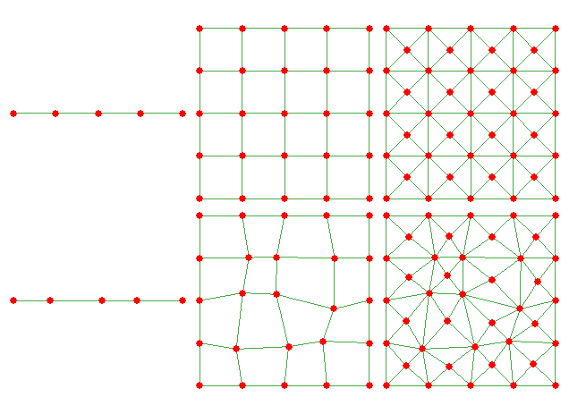

# 🧮 Advection-Diffusion-Reaction Equation

The steady ADR equation models scalar transport under simultaneous diffusion, advection, and reaction:

$$
-\nabla \cdot (\nu \nabla u + \mathbf{a} u) + c\,u = f, \quad \text{in } \mathcal{B},
$$

$$
u = g_D \quad \text{on } \partial\mathcal{B}_D, \quad \mathbf{n}\cdot(\nu\nabla u+\mathbf{a}u)=g_N \quad \text{on } \partial\mathcal{B}_N.
$$

**Parameters:**
- $\nu > 0$: Diffusion coefficient  
- $\mathbf{a}$: Advection velocity  
- $c \ge 0$: Reaction coefficient  
- $f$: Source term  

**Remark:** Piecewise-constant coefficients. Homogeneous Dirichlet $g_D = 0$ in least-squares formulations.

## 🎯 1D Benchmark Solutions

**Boundary layer:**
$$ u(x) = 1 - \dfrac{\sinh(x/\sqrt{\varepsilon}) + \sinh((1-x)/\sqrt{\varepsilon})}{\sinh(1/\sqrt{\varepsilon})} $$

**Interior layer:**
$$ u(x) = 4\left(\arctan\!\Big(\dfrac{2(1/16-(x-1/2)^2)}{\pi\sqrt{\varepsilon}}\Big) + \tfrac{1}{2}\right)(1-x)x $$

## 🧩 Mesh Configurations

**Top row:** Regular meshes (1D, quad 2D, triangular 2D)  
**Bottom row:** Perturbed meshes ($\alpha=0.2$) for robustness testing

## 📊 Mesh Information

### 1D Case
| Level | Elements | $h$    | SFEM P₁ | SFEM P₂ | LSFEM P₁P₁ | LSFEM P₂P₂ |
|-------|----------|--------|---------|---------|------------|------------|
| 4     | 16       | 1/16   | 17      | 33      | 34         | 66         |
| 5     | 32       | 1/32   | 33      | 65      | 66         | 130        |
| 6     | 64       | 1/64   | 65      | 129     | 130        | 258        |
| 7     | 128      | 1/128  | 129     | 257     | 258        | 514        |
| 8     | 256      | 1/256  | 257     | 513     | 514        | 1026       |
| 9     | 512      | 1/512  | 513     | 1025    | 1026       | 2050       |
| 10    | 1024     | 1/1024 | 1025    | 2049    | 2050       | 4098       |

