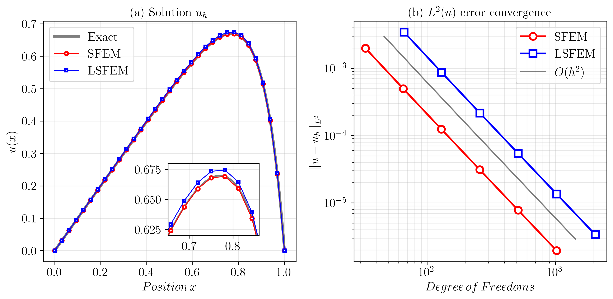
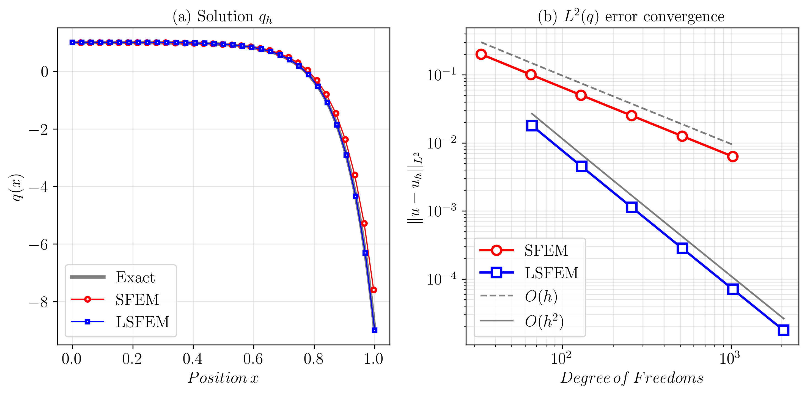

## 📊 Numerical Results for $\epsilon = 10^{-1}$

This study compares the Standard Finite Element Method (SFEM) and Least-Squares Finite Element Method (LSFEM) for solving the 1D Poisson equation with parameter $\epsilon = 10^{-1}$. Both methods are tested on regular and perturbed grids across five mesh levels (ML4-ML8, corresponding to 16-256 elements).

#

### Methods Compared

- **SFEM (Standard Galerkin FEM)**: Primal formulation with solution variable u
- **LSFEM (Least-Squares FEM)**: First-order system with ($u$, $q = -u^\prime$) as unknowns

- **Element Types:** $P_1$ (linear) and $P_2$ (quadratic)
- **Mesh Types:** Regular (RG) and Perturbed (PG) Grids
- **Mesh Levels:** ML4 (16 elements) to ML8 (256 elements)

#

## Main Results Summary

🎯 **Key Finding: LSFEM's Superior Flux Accuracy**
**For $P_1$ elements at ML8:**

- Solution u: SFEM is 1.74× more accurate
- **Flux q: LSFEM is 89× more accurate** ⭐

**For $P_2$ elements at ML8:**

- Solution u: LSFEM is 1.09× more accurate (actually better!)
- **Flux q: LSFEM is 203× more accurate** ⭐⭐⭐

**The flux accuracy difference grows with mesh refinement due to higher convergence rates.**

#

### 🧩 Solution variable $u$

Figure 1 depicts the solution $u$ at mesh level 5 (ML5 / 32 elements) and the $L^2(u)$ errors for regular grids with $P_1$ elements.

**Figure 1.** (a) Solution $u_h$ for ML5 (32 elements), (b) $L^2(u)$ error convergence. 

Both methods achieve optimal second-order convergence for the primary solution variable:

- **SFEM**: Convergence rate $\approx$ 2.00, achieving $O(h^2)$ accuracy
- **LSFEM**: Convergence rate $\approx$ 2.00, achieving $O(h^2)$ accuracy
- **Accuracy comparison**: SFEM produces approximately $1.7 \times$ smaller errors for u

At the finest mesh (ML8):

- SFEM: $L^2$ error = 3.1145e-05
- LSFEM: $L^2$ error = 5.3962e-05

**Table 1: $L^2$ Error $\| u - u_h \|_0$** for $P_1$ elements / RG = Regular Grid, PG = Perturbed Grid

| Method | ML 4 | ML 5 | ML 6 | ML 7 | ML 8 |
|--------|------|------|------|------|------|
| SFEM / RG   | 7.7953e-03 | 1.9821e-03 | 4.9766e-04 | 1.2455e-04 | 3.1145e-05 |
| LSFEM / RG  | 1.3594e-02 | 3.4398e-03 | 8.6257e-04 | 2.1581e-04 | 5.3962e-05 |
|             |            |            |            |            |            |
| SFEM / PG   | 1.0181e-02 | 1.9912e-03 | 5.7947e-04 | 1.4927e-04 | 3.4878e-05 |
| LSFEM / PG  | 1.6742e-02 | 3.4810e-03 | 9.7084e-04 | 2.4665e-04 | 5.8935e-05 |

**Table 2: $L^2(u)$ Ratios** for $P_1$ elements on regular grids / RG = Regular Grid, PG = Perturbed Grid

| Method | ML4→5 | ML5→6 | ML6→7 | ML7→8 | Asymptotic |
|--------|-------|-------|-------|-------|------------|
| SFEM / RG  | 3.93 | 3.98 | 4.00 | 4.00 | ✅ |
| LSFEM / RG | 3.95 | 3.99 | 4.00 | 4.00 | ✅ |
|            |      |      |      |      |     |
| SFEM / PG  | 5.11 | 3.44 | 3.88 | 4.28 | ✅ |
| LSFEM / PG | 4.81 | 3.59 | 3.94 | 4.19 | ✅ |

**Table 3: $L^2$ Error $\| u - u_h \|_0$** for $P_2$ elements / RG = Regular Grid, PG = Perturbed Grid

| Method | ML 4 | ML 5 | ML 6 | ML 7 | ML 8 |
|--------|------|------|------|------|------|
| SFEM / RG   | 2.5682e-04 | 3.2647e-05 | 4.0983e-06 | 5.1283e-07 | 7.0115e-08 |
| LSFEM / RG  | 2.6312e-04 | 3.2849e-05 | 4.1047e-06 | 5.1303e-07 | 6.4128e-08 |
|             |            |            |            |            |            |
| SFEM / PG   | 3.9714e-04 | 3.4124e-05 | 5.3776e-06 | 7.1791e-07 | 8.1484e-08 |
| LSFEM / PG  | 4.1081e-04 | 3.4360e-05 | 5.3909e-06 | 7.2076e-07 | 8.0282e-08 |

**Table 4: $L^2(u)$ ratios** for $P_2$ elements on regular grids / RG = Regular Grid, PG = Perturbed Grid

| Method | ML4→5 | ML5→6 | ML6→7 | ML7→8 | Asymptotic |
|--------|-------|-------|-------|-------|------------|
| SFEM / RG  | 7.87 | 7.97 | 7.99 | 7.31 | 🔴 |
| LSFEM / RG | 8.01 | 8.00 | 8.00 | 8.00 | ✅ |
|            |      |      |      |      |     |
| SFEM / PG  | 11.64 | 6.35 | 7.49 | 8.81 | ✅ |
| LSFEM / PG | 11.96 | 6.37 | 7.48 | 8.98 | ✅ |

SFEM ratio at ML7→8 degrades

#

### 🧩 Solution flux variable $q$

**Figure 2 depicts the solution $q$ at mesh level 5 (ML5 / 32 elements) and the $L^2(q)$ errors for regular grids.**

**Table 5: $L^2$ Error $\| q - q_h \|_0$** for $P_1$ elements / RG = Regular Grid, PG = Perturbed Grid

| Method | ML 4 | ML 5 | ML 6 | ML 7 | ML 8 |
|--------|------|------|------|------|------|
| SFEM / RG   | 3.9579e-01 | 2.0075e-01 | 1.0074e-01 | 5.0416e-02 | 2.5214e-02 |
| LSFEM / RG  | 7.0335e-02 | 1.7933e-02 | 4.5057e-03 | 1.1278e-03 | 2.8204e-04 |
|             |            |            |            |            |            |
| SFEM / PG   | 4.4342e-01 | 1.9879e-01 | 1.0656e-01 | 5.3637e-02 | 2.6144e-02 |
| LSFEM / PG  | 9.3888e-02 | 1.7910e-02 | 5.3102e-03 | 1.3730e-03 | 3.1838e-04 |

**Table 6: $L^2(q)$ Ratios** for $P_1$ elements on regular grids / RG = Regular Grid, PG = Perturbed Grid

| Method | ML4→5 | ML5→6 | ML6→7 | ML7→8 | Asymptotic |
|--------|-------|-------|-------|-------|------------|
| SFEM / RG  | 1.97 | 1.99 | 2.00 | 2.00 | ✅ |
| LSFEM / RG | 3.92 | 3.98 | 3.99 | 4.00 | ✅ |
|            |      |      |      |      |     |
| SFEM / PG  | 2.23 | 1.87 | 1.99 | 2.05 | ✅ |
| LSFEM / PG | 5.24 | 3.37 | 3.87 | 4.31 | ✅ |

**Table 7: $L^2$ Error $\| q - q_h \|_0$** for $P_2$ elements / RG = Regular Grid, PG = Perturbed Grid

| Method | ML 4 | ML 5 | ML 6 | ML 7 | ML 8 |
|--------|------|------|------|------|------|
| SFEM / RG   | 3.1678e-02 | 8.0825e-03 | 2.0311e-03 | 5.0843e-04 | 1.3006e-04 |
| LSFEM / RG  | 2.5680e-03 | 3.2646e-04 | 4.0983e-05 | 5.1283e-06 | 6.4122e-07 |
|             |            |            |            |            |            |
| SFEM / PG   | 4.1298e-02 | 8.1191e-03 | 2.3646e-03 | 6.0959e-04 | 1.4309e-04 |
| LSFEM / PG  | 3.9709e-03 | 3.4119e-04 | 5.3799e-05 | 7.2036e-06 | 8.0272e-07 |

**Table 8: $L^2(q)$ ratios** for $P_2$ elements on regular grids / RG = Regular Grid, PG = Perturbed Grid

| Method | ML4→5 | ML5→6 | ML6→7 | ML7→8 | Asymptotic |
|--------|-------|-------|-------|-------|------------|
| SFEM / RG  |  3.92 | 3.98 | 3.99 | 3.91 | ✅ |
| LSFEM / RG |  7.87 | 7.97 | 7.99 | 8.00 | ✅ |
|            |      |      |      |      |     |
| SFEM / PG  |  5.09 | 3.43 | 3.88 | 4.26 | ✅ |
| LSFEM / PG | 11.64 | 6.34 | 7.47 | 8.97 | ✅ |

#

### ⚡ Solver performance 

**Without preconditioning (CG):** 🔴

- Iteration count doubles with each mesh refinement (O(N) growth)
- ML5: 32/33 iterations → ML10: 513/541 iterations 
- Impractical for large-scale problems

**Jacobi preconditioning (CG-JACOBI):** 🟡

- Modest improvement, eliminates ~1 iteration per level on regular grids
- Still exhibits O(N) scaling behavior
- ML5: 31/32 iterations → ML8: 511/514 iterations
- Negligible improvement over unpreconditioned CG

**Algebraic multigrid (CG-AMG): ⭐ Mesh-independent convergence!**  🟢

- Iteration count grows sub-linearly with DOF (~O(N^0.6))
- ML4: 7/7 iterations → ML8: 45/46 iterations
- **~11× reduction compared to unpreconditioned CG at ML8**
- **~11× reduction compared to Jacobi-preconditioned CG at ML8**

**Table 9: CG - iteration counts of $P_1$ elements (Regular/Perturbed)**
| Mesh | CG | CG-JACOBI | CG-AMG |
|------|----|-----------|------------------|
| ML4  |  32 /  33 |  31 /  32 |  7 /  7 |
| ML5  |  64 /  66 |  63 /  64 | 10 / 10 |
| ML6  | 128 / 133 | 127 / 128 | 16 / 16 |
| ML7  | 256 / 269 | 255 / 256 | 26 / 26 |
| ML8  | 513 / 541 | 511 / 514 | 45 / 46 |

**Table 10: CG - iteration counts of $P_2$ elements (Regular/Perturbed)**
| Mesh | CG | CG-JACOBI | CG-AMG |
|------|----|-----------|------------------|
| ML4  |   68 /   74 |   66 /   67 |  16 /  17 |
| ML5  |  141 /  151 |  138 /  139 |  27 /  27 |
| ML6  |  286 /  311 |  283 /  285 |  42 /  43 |
| ML7  |  578 /  638 |  576 /  582 |  70 /  71 |
| ML8  | 1162 / 1289 | 1163 / 1178 | 124 / 126 |

AMG preconditioning reduces iteration counts dramatically, growing approximately as $O(h^{-0.6})$ compared to $O(h^{-1})$ for unpreconditioned CG. This is essential for the practical application of LSFEM, which produces larger symmetric systems.

