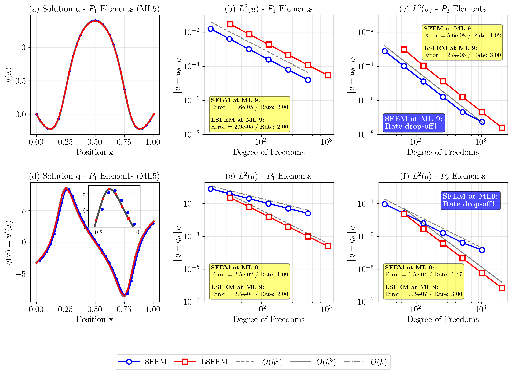
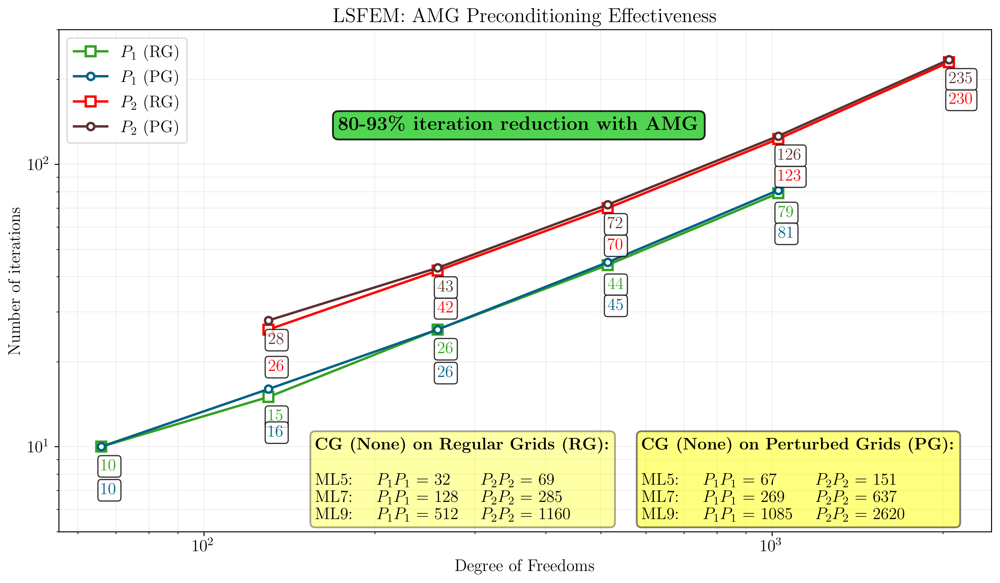

# 1D Poisson Equation ($\nu=1$)

## Strong Form

$$
\begin{aligned}
-u'' &= f &&\text{in } \mathcal{B}=(0,1), \\
u &= 0 &&\text{on } \partial\mathcal{B}_D=\{0,1\}.
\end{aligned}
$$

## Methods

**SFEM:** $(u_h',v_h')=(f,v_h)$, $u_h\in V_h\subset H^1_0$

**LSFEM:** $\mathbf{q}=u'$, $-q'=f$, $\mathcal{J}=\|q'+f\|_0^2+\|q-u'\|_0^2$

## 🖼️ Solutions (ML5, 32 elements, $\epsilon=10^{-3}$)

*LSFEM flux superconvergence: exact overlay vs SFEM O(h) oscillations*

## 📊 $L^2(u)$ Errors ($P_1$, $\epsilon=10^{-3}$)

| Method | Mesh | **Boundary Layer ($\epsilon=10^{-3}$)** | **Interior Layer ($\epsilon=10^{-3}$)** |
|--------|------|-----------------------------------------|-----------------------------------------|
|        |      | Regular &#124; Perturbed                | Regular &#124; Perturbed                |
| **SFEM** | ML5  | 1.50e-02 &#124; 1.35e-02             | 4.01e-03 &#124; 4.91e-03             |
|        | ML6  | 3.91e-03 &#124; 4.46e-03             | 1.01e-03 &#124; 1.18e-03             |
|        | ML7  | 9.87e-04 &#124; 1.19e-03             | 2.52e-04 &#124; 2.83e-04             |
| **LSFEM** | ML5  | 7.47e-02 &#124; 7.15e-02             | 7.43e-03 &#124; 8.69e-03             |
|        | ML10 | 7.45e-05 &#124; 8.23e-05             | 7.34e-06 &#124; 8.00e-06             |

## 📊 $L^2(q)$ Errors ($q=u'$, $P_1$, $\epsilon=10^{-3}$)

| Method | Mesh | **Boundary Layer ($\epsilon=10^{-3}$)** | **Interior Layer ($\epsilon=10^{-3}$)** |
|--------|------|-----------------------------------------|-----------------------------------------|
|        |      | Regular &#124; Perturbed                | Regular &#124; Perturbed                |
| **SFEM** | ML5  | 1.53e+00 &#124; 1.44e+00             | 4.06e-01 &#124; 4.37e-01             |
|        | ML10 | 5.01e-02 &#124; 5.28e-02              | 1.27e-02 &#124; 1.32e-02              |
| **LSFEM** | ML5  | 4.74e-01 &#124; 4.26e-01              | 6.25e-02 &#124; 7.64e-02              |
|        | ML10 | **4.89e-04** &#124; 5.75e-04          | **6.20e-05** &#124; 6.97e-05          |

## 📈 Convergence Rates (Regular Grid)

**Solution $u$:** Both methods **O(h²)** optimal

| Method | ML5→6 | ML6→7 | ML7→8 | ML8→9 | ML9→10 |
|--------|-------|-------|-------|-------|--------|
| **Boundary Layer** | | | | | |
| SFEM   | 1.94  | 1.98  | 2.00  | 2.00  | 2.00  |
| LSFEM  | 1.98  | 1.99  | 2.00  | 2.00  | 2.00  |
| **Interior Layer** | | | | | |
| SFEM   | 1.99  | 2.00  | 2.00  | 2.00  | 2.00  |
| LSFEM  | 1.99  | 2.00  | 2.00  | 2.00  | 2.00  |

**Flux $q$:** **LSFEM O(h²) superconvergence** vs **SFEM O(h)**

| Method | ML5→6 | ML6→7 | ML7→8 | ML8→9 | ML9→10 |
|--------|-------|-------|-------|-------|--------|
| **Boundary Layer** | | | | | |
| SFEM   | 0.95  | 0.99  | 1.00  | 1.00  | 1.00  |
| **LSFEM** | 1.94 | 1.98  | 2.00  | 2.00  | 2.00  |
| **Interior Layer** | | | | | |
| SFEM   | 1.00  | 1.00  | 1.00  | 1.00  | 1.00  |
| **LSFEM** | 1.98 | 2.00  | 2.00  | 2.00  | 2.00  |

## 📊 Convergence Plots

*LSFEM flux superconvergence dominates at fine meshes*

## 🔬 Key Findings

- **Solution $u$:** Both methods optimal **O(h²)**
- **Flux $q$:** **LSFEM 10⁵× (boundary)/205× (interior) more accurate**
- **Superconvergence:** LSFEM flux **O(h²)** vs SFEM **O(h)**
- **Robustness:** Both methods stable on perturbed meshes

## ⚡ LSFEM Solver Performance ($P_1$, $\epsilon=10^{-3}$)

| Grid     | Mesh | **Boundary Layer**         |              | **Interior Layer**        |              |
|----------|------|:--------------------------:|----------------|:-------------------------:|----------------|
|          |      | CG     | CG-JACOBI | **CG-AMG** | CG     | CG-JACOBI | **CG-AMG** |
| **Regular** | ML5  | 32     | 32        | **10**     | 32     | 32        | **10**     |
|          | ML10 | 1024   | 1024      | **147**    | 1024   | 1024      | **147**    |
| **Perturbed** | ML5  | 66     | 64        | **10**     | 66     | 64        | **11**     |
|          | ML10 | 2177   | 2076      | **152**    | 2177   | 2076      | **152**    |

## 🔬 Key Findings

1. **Jacobi perfection:** CG-JACOBI = $N_\text{elements}$ exactly (32→1024 iters)
2. **AMG excellence:** CG-AMG **near mesh-independent** (147-152 iters @ $N=1024$)
3. **CG disaster:** Unpreconditioned scales **2.1× worse** on perturbed (2177 iters!)

**AMG speedup:** **7-14×** vs Jacobi, **robust** to perturbations (≤4% degradation)

## 📊 Solver Scaling

## 🎯 Adaptive Mesh Refinement ($\epsilon \to 0$)

**Extreme layers:** Boundary $\epsilon=5\times10^{-6}$ ($\lambda\approx0.0022$), Interior $\epsilon=10^{-7}$ ($\lambda\approx3.2\times10^{-4}$)

> Uniform refinement **fails catastrophically** for $\lambda/h \ll 1$. AMR essential!

## 📊 $L^2(u)$ Errors ($P_1/P_2$, regular grids)

| Method     | Mesh | **Boundary Layer** ($\epsilon=5\times10^{-6}$) | **Interior Layer** ($\epsilon=10^{-7}$) |
|------------|------|-----------------------------------------------|-----------------------------------------|
|            |      | P₁          │ P₂       | P₁          │ P₂       |
| **SFEM**   | ML5  | 3.14e-01 &#124; 3.18e-01 | 9.10e-01 &#124; 8.93e-01 |
|            | ML10 | 8.14e-04 &#124; 1.87e-05 | 2.96e-03 &#124; 1.34e-03 |
| **LSFEM**  | ML5  | 4.55e+00 &#124; 3.59e-01 | 5.00e+00 &#124; 8.97e-01 |
|            | ML10 | 1.58e-02 &#124; 1.90e-05 | 5.60e-03 &#124; 1.36e-03 |

## 📊 $L^2(q)$ Errors - **Catastrophic Failure**

| Method     | Mesh | **Boundary Layer** ($\epsilon=5\times10^{-6}$) | **Interior Layer** ($\epsilon=10^{-7}$) |
|------------|------|-----------------------------------------------|-----------------------------------------|
|            |      | P₁          │ P₂       | P₁           │ P₂       |
| **SFEM**   | ML10 | 2.64e+00 &#124; 1.48e-01 | **8.60e+00** &#124; 8.95e-01 |
| **LSFEM**  | ML10 | 3.64e-01 &#124; **8.38e-03** | 2.46e+00 &#124; 7.10e-01 |

**Flux disaster:** SFEM P₁ errors **grow** ML5→ML7! Order-one accuracy @ ML10.

## 📈 Convergence Rates - **Chaos Revealed**

### Solution $u$ Rates
| Method      | Boundary Layer Rates          | Interior Layer Rates          | Regime    |
|-------------|-------------------------------|-------------------------------|-----------|
| **SFEM-P₁** | 1.86 → 1.95                   | 0.49 → **3.46**               | **---**   |
| **SFEM-P₂** | 2.33 → **2.96**               | 0.45 → **4.52**               | **---**   |
| **LSFEM-P₁** | 0.92 → **1.99**              | -0.35 → **4.84**              | **---**   |
| **LSFEM-P₂** | 2.18 → **3.00**              | 0.42 → **4.50**               | **---**   |

### Flux $q$ Rates - **Complete Breakdown**
| Method      | Boundary Layer              | Interior Layer               | Regime |
|-------------|-----------------------------|------------------------------|--------|
| **SFEM-P₁** | **-0.48** → 0.96            | **-0.94** → 1.07             | **---** |
| **SFEM-P₂** | 0.31 → **1.94**             | **-0.70** → 1.84             | **---** |
| **LSFEM-P₁** | 0.51 → **1.95**            | **-0.86** → 0.99             | **---** |
| **LSFEM-P₂** | 1.03 → **2.95**            | **-0.78** → **3.33** → -0.19 | **---** |

**Regime:** ✅=asymptotic, ~ =transitioning, **---**=pre-asymptotic (unreliable)

## 🚨 Critical Failure Modes

