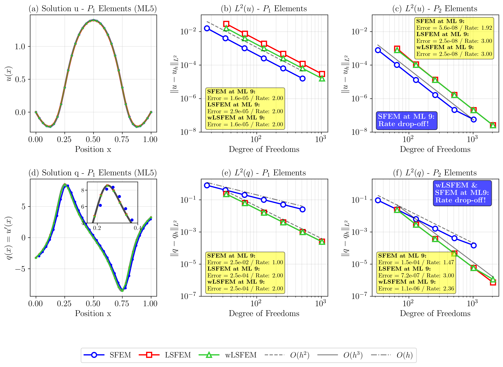
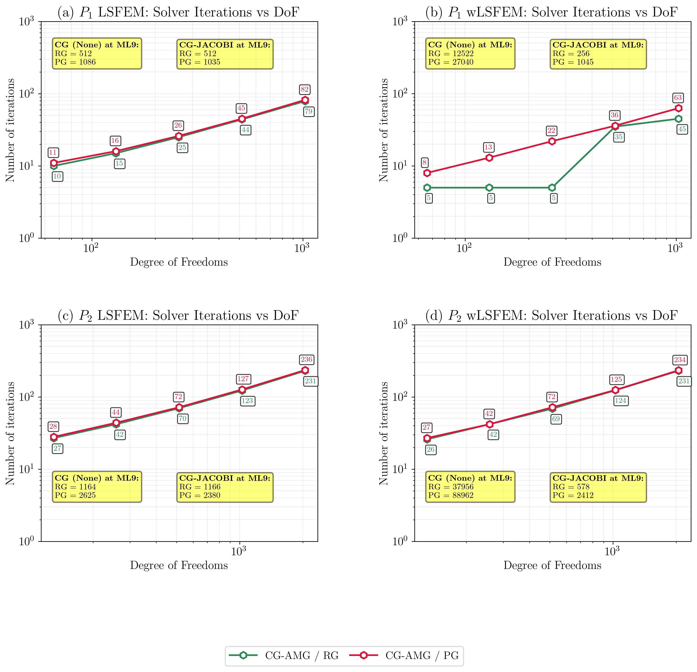
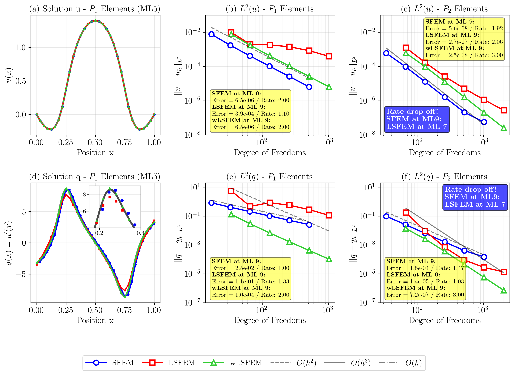
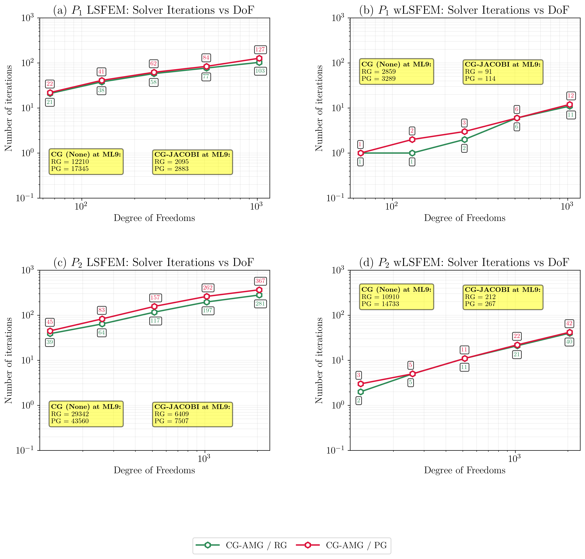

## 1D Diffusion-Reaction Equation

### Strong Form

$$
\begin{aligned}
-u^{\prime\prime} + cu &= f \quad &&\text{in } {\cal B} = (0,1), \\
u(0) = u(1) &= 0 \quad &&\text{on } \partial{\cal B}_D
\end{aligned}
$$

where $c \geq 0$ is the reaction coefficient. Two parameter regimes are investigated:
- **Diffusion-dominated:** $c = 10^{-4}$ (diffusion >> reaction)
- **Reaction-dominated:** $c = 10^{4}$ (reaction >> diffusion)

Analytical solution with $\epsilon = 10^{-3}$:

$$
u(x) = 4\left(\arctan\left(\frac{2(1/16-(x-1/2)^2)}{\pi\sqrt{\epsilon}}\right) + \frac{1}{2}\right)(1-x)x
$$

**Test Configuration:**
- Mesh levels: ML5 (32 elements) to ML9 (512 elements)
- Element types: $P_1$ (linear) and $P_2$ (quadratic)
- Mesh types: Regular and perturbed grids

---
## Methods Compared

### 1. Standard Galerkin FEM (SFEM)

The classical Galerkin finite element formulation seeks $u_h \in V_h \subset H^1_0({\cal B})$ such that

$$(u^\prime_h, v^\prime_h)_0 + c(u_h, v_h)_0 = (f, v_h)_0 \quad \forall v_h \in V_h$$

### 2. Least Squares FEM (LSFEM)

**First-Order System**

Define the diffusive flux $q = u^\prime$:

$$-q^\prime + cu = f, \qquad q - u^\prime = 0$$

### Functional

$${\cal J}(u,q;f) = \frac{1}{2} \parallel w_1 (-q^\prime + cu - f) \parallel^2_0 + \frac{1}{2} \parallel q - u^\prime \parallel^2_0$$

**Weighting analyzed:**
- **LSFEM**: $w_1 = 1$ (unweighted)
- **wLSFEM**: $w_1 = c^{-1/2}$ (balanced scaling)

### Variational Formulation

The discrete variational form seeks $(u_h, q_h) \in V_h \times Q_h$ satisfying

$${\cal A}((u_h,q_h);(v_h,r_h)) = {\cal F}(v_h,r_h), \quad \forall (v_h,r_h) \in V_h \times Q_h$$

with

$${\cal A}((u_h,q_h);(v_h,r_h)) = w^2_1 (-q^\prime_h + c u_h , -r^\prime_h + c v_h)_0 + (q_h - u^\prime_h, r_h - v^\prime_h)_0$$

$${\cal F}(v_h,r_h) = w^2_1 (f, -r^\prime_h + c v_h)_0$$

---

## 🎯 Results: Diffusion-Dominated ($c = 10^{-4}$)

### Convergence Behavior

**$P_1$ Elements:**
- **SFEM:** Optimal rates (ratio ≈ 4.0 for $u$, ≈ 2.0 for $q$)
- **LSFEM:** Optimal rates (ratio ≈ 4.0 for both $u$ and $q$) ✅
- **wLSFEM:** Optimal rates (ratio ≈ 4.0 for both $u$ and $q$), **matches SFEM exactly for $u$** ✅

**$P_2$ Elements:**
- **SFEM:** High-order convergence (ratio ≈ 8.0 for $u$, ≈ 4.0 for $q$), **BUT ML9 drop-off!** ⚠️
  - At ML9: ratio drops to 3.77 for $u$, 2.78 for $q$
- **LSFEM:** Excellent! (ratio ≈ 8.0 for both $u$ and $q$), **no ML9 drop-off** ✅
- **wLSFEM:** Matches SFEM for $u$, maintains ratio ≈ 8.0 for $q$ ✅

### Computational Efficiency

**Key Observation:** wLSFEM has **catastrophic unpreconditioned iteration counts** but performs well with preconditioning.

**$P_1$ Elements (ML9, Regular mesh):**

| Method | CG | CG-JACOBI | CG-AMG | AMG Reduction |
|--------|----|-----------| -------|---------------|
| LSFEM | 256 | 256 | 79 | 69% |
| wLSFEM | **12,522** ❌ | 256 | 45 | **99.6%** |

**$P_2$ Elements (ML9, Regular mesh):**

| Method | CG | CG-JACOBI | CG-AMG | AMG Reduction |
|--------|----|-----------| -------|---------------|
| LSFEM | 1,164 | 1,166 | 231 | 80% |
| wLSFEM | **37,956** ❌ | 578 | 231 | **99.4%** |

**Conclusion:** For diffusion-dominated problems, **LSFEM is the best choice**. wLSFEM requires mandatory preconditioning.

---

## 🎯 Results: Reaction-Dominated ($c = 10^{4}$)

### Convergence Behavior

**$P_1$ Elements:**
- **SFEM:** Optimal rates maintained (ratio ≈ 4.0 for $u$, ≈ 2.0 for $q$) ✅
- **LSFEM:** **Complete breakdown!** Convergence rates collapse to ~1.0-2.5, highly irregular ❌
- **wLSFEM:** **Excellent!** Optimal rates (ratio ≈ 4.0 for both $u$ and $q$), matches SFEM for $u$ ✅

**$P_2$ Elements:**
- **SFEM:** Good convergence (ratio ≈ 8.0 for $u$, ≈ 4.0 for $q$), **ML9 drop-off persists** ⚠️
  - At ML9: ratio drops to 3.77 for $u$, 2.78 for $q$
- **LSFEM:** **Catastrophic failure!** Ratios drop to ~2.0-4.0, even worse than $P_1$ ❌
- **wLSFEM:** **Perfect!** Maintains ratio ≈ 8.0 for both $u$ and $q$, **no ML9 drop-off!** ✅✅

**Critical Finding:** wLSFEM **eliminates the SFEM ML9 drop-off** observed in both Poisson and diffusion-reaction problems!

### Computational Efficiency

**$P_1$ Elements (ML9, Regular mesh):**

| Method | CG | CG-JACOBI | CG-AMG | AMG Reduction |
|--------|----|-----------| -------|---------------|
| LSFEM | 12,210 | 2,095 | 103 | 99% |
| wLSFEM | 2,859 | 91 | 11 | **99.6%** ✅ |

**$P_2$ Elements (ML9, Regular mesh):**

| Method | CG | CG-JACOBI | CG-AMG | AMG Reduction |
|--------|----|-----------| -------|---------------|
| LSFEM | 29,342 | 6,409 | 281 | 99% |
| wLSFEM | 10,910 | 212 | 40 | **99.6%** ✅ |

**Conclusion:** For reaction-dominated problems, **wLSFEM is essential**. Standard LSFEM fails completely.

---

## 🎯 Mesh Perturbation Analysis

All three methods demonstrate robustness to mesh perturbations across both parameter regimes:
- Convergence rates remain nearly identical on perturbed vs. regular grids
- Iteration counts increase moderately on perturbed grids (typically 2× for unpreconditioned CG)
- AMG preconditioning maintains effectiveness on perturbed grids

---

## 💡 Key Takeaways

### Method Selection Guidelines

| Problem Type | Best Method | Rationale |
|--------------|-------------|-----------|
| **Diffusion-Dominated** ($c \ll 1$) | **LSFEM** | Optimal convergence, acceptable iterations, no special requirements |
| **Reaction-Dominated** ($c \gg 1$) | **wLSFEM** | Only method with optimal convergence, eliminates ML9 drop-off |
| **Mixed/Unknown Regime** | **wLSFEM + Preconditioning** | Robust across all regimes, but requires CG-JACOBI or AMG |

### Critical Observations

1. **Weighting is Essential for Reaction-Dominated Problems**
   - Standard LSFEM completely fails when $c = 10^4$
   - Proper norm balancing via weighting restores optimal convergence

2. **wLSFEM Eliminates SFEM's Numerical Precision Issues**
   - SFEM shows ML9 convergence drop-off for $P_2$ elements in both Poisson and diffusion-reaction
   - wLSFEM maintains optimal rates at ML9, suggesting better numerical stability

3. **Preconditioning is Mandatory for wLSFEM in Diffusion-Dominated Regime**
   - Unpreconditioned CG iteration counts explode (38,000+ iterations)
   - CG-JACOBI or AMG reduces iterations by 99%+

4. **Flux Accuracy Advantage**
   - Both LSFEM and wLSFEM achieve optimal $O(h^{p+1})$ convergence for flux
   - SFEM limited to $O(h^p)$ flux convergence

5. **AMG Effectiveness**
   - 80-99% iteration reduction across all methods and parameter regimes
   - Particularly critical for wLSFEM in diffusion-dominated problems

### Computational Cost Summary

For practical applications with preconditioning (CG-AMG):
- **Diffusion-dominated:** LSFEM and wLSFEM comparable (~80-230 iterations)
- **Reaction-dominated:** wLSFEM significantly better (11-40 iterations vs. 103-281 for LSFEM)
