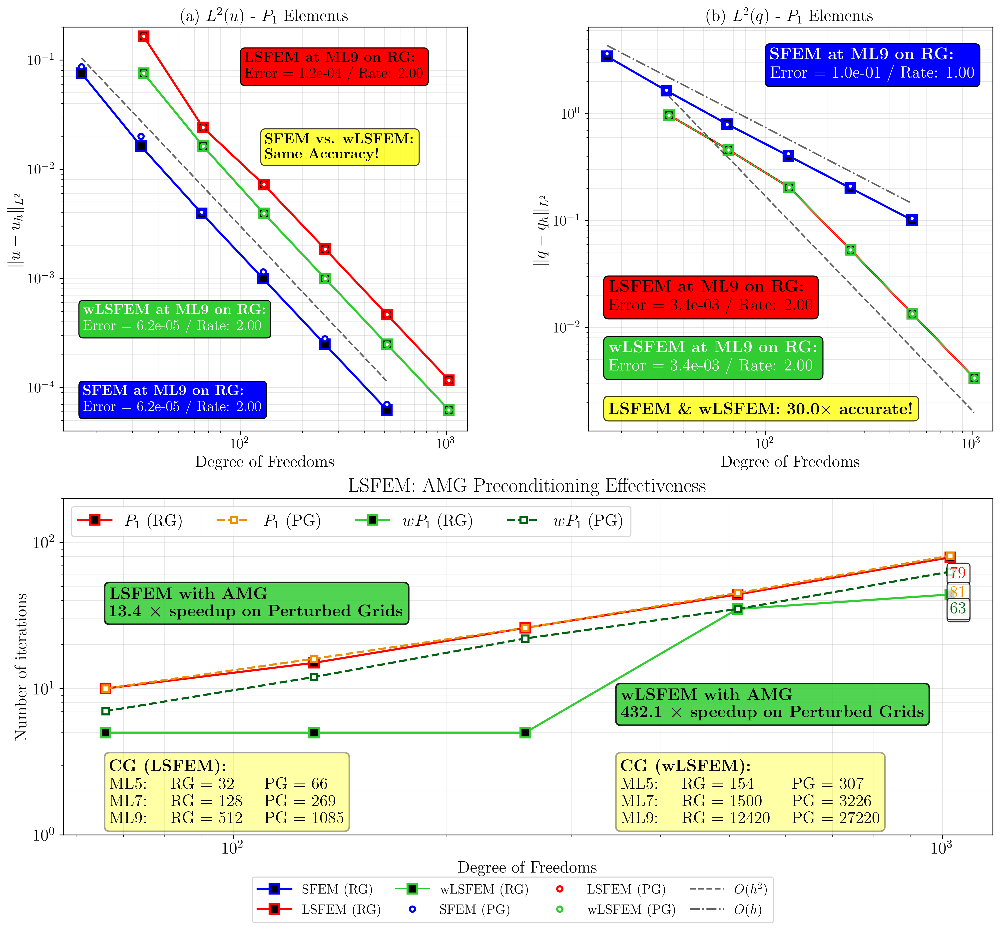
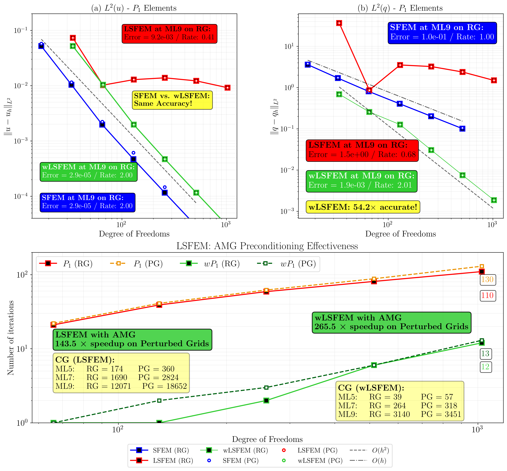
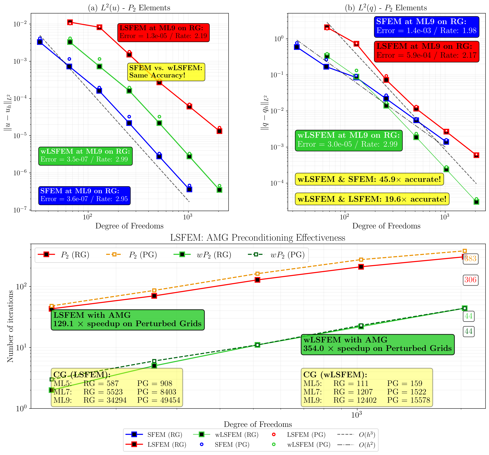

## 1D Diffusion-Reaction Equation

### Strong Form

$$
\begin{aligned}
-u^{\prime\prime} + cu &= f \quad &&\text{in } {\cal B} = (0,1), \\
u(0) = u(1) &= 0 \quad &&\text{on } \partial{\cal B}_D
\end{aligned}
$$

where $c \geq 0$ is the reaction coefficient. Two parameter regimes are investigated:
- **Diffusion-dominated:** $c = 10^{-4}$ (diffusion >> reaction)
- **Reaction-dominated:** $c = 10^{4}$ (reaction >> diffusion)

Analytical solution with $\epsilon = 10^{-4}$:

$$
u(x) = 4\left(\arctan\left(\frac{2(1/16-(x-1/2)^2)}{\pi\sqrt{\epsilon}}\right) + \frac{1}{2}\right)(1-x)x
$$

**Test Configuration:**
- Mesh levels: ML5 (32 elements) to ML9 (512 elements)
- Element types: $P_1$ (linear) and $P_2$ (quadratic)
- Mesh types: Regular and perturbed grids

---
## Methods Compared

### 1. Standard Galerkin FEM (SFEM)

The classical Galerkin finite element formulation seeks $u_h \in V_h \subset H^1_0({\cal B})$ such that

$$(u^\prime_h, v^\prime_h)_0 + c(u_h, v_h)_0 = (f, v_h)_0 \quad \forall v_h \in V_h$$

### 2. Least Squares FEM (LSFEM)

**First-Order System**

Define the diffusive flux $q = u^\prime$:

$$-q^\prime + cu = f, \qquad q - u^\prime = 0$$

### Functional

$${\cal J}(u,q;f) = \frac{1}{2} \parallel w_1 (-q^\prime + cu - f) \parallel^2_0 + \frac{1}{2} \parallel q - u^\prime \parallel^2_0$$

**Weighting analyzed:**
- **LSFEM**: $w_1 = 1$ (unweighted)
- **wLSFEM**: $w_1 = c^{-1/2}$ (balanced scaling)

### Variational Formulation

The discrete variational form seeks $(u_h, q_h) \in V_h \times Q_h$ satisfying

$${\cal A}((u_h,q_h);(v_h,r_h)) = {\cal F}(v_h,r_h), \quad \forall (v_h,r_h) \in V_h \times Q_h$$

with

$${\cal A}((u_h,q_h);(v_h,r_h)) = w^2_1 (-q^\prime_h + c u_h , -r^\prime_h + c v_h)_0 + (q_h - u^\prime_h, r_h - v^\prime_h)_0$$

$${\cal F}(v_h,r_h) = w^2_1 (f, -r^\prime_h + c v_h)_0$$

---

## 🎯 Results: Diffusion-Dominated ($c = 10^{-4}$)

### Accuracy and Solver Performance

**P1 Elements (Linear)**

**Figure 1** compares Standard FEM (SFEM), Least-Squares FEM (LSFEM), and weighted LSFEM (wLSFEM) using P1 elements:

- **Solution accuracy ($L^2$ norm of u):** SFEM and wLSFEM achieve identical second-order convergence $(O(h²))$ with the same error at ML9. LSFEM is slightly less accurate (2× worse) but maintains second-order convergence.
- **Flux accuracy ($L^2$ norm of q):** Both LSFEM and wLSFEM significantly outperform SFEM, achieving second-order convergence $(O(h²))$ compared to SFEM's first-order convergence $(O(h))$. Both methods are **30× more accurate** for flux computation with identical performance.
- **AMG preconditioning:** LSFEM shows excellent preconditioning with a **13.4× speedup** on perturbed grids. Remarkably, wLSFEM demonstrates even more dramatic improvements with a **432.1×** speedup on perturbed grids, though it requires more iterations than LSFEM without preconditioning.

**P2 Elements (Quadratic)**

*Figure 2 compares the same methods using P2 elements:

- **Solution accuracy ($L^2$ norm of u):** All three methods achieve nearly identical third-order convergence $(O(h^3))$, with comparable accuracy at ML9.
- **Flux accuracy ($L^2$ norm of q):** Both LSFEM and wLSFEM excel equally, maintaining third-order convergence $(O(h^3))$ while SFEM shows second-order $(O(h^2))$. LSFEM and wLSFEM are **45.9× more** accurate for flux computation.
- **AMG preconditioning: LSFEM shows an **11.2× speedup** on perturbed grids with AMG. wLSFEM again demonstrates exceptional preconditioning effectiveness with a **381× speedup** on perturbed grids, despite requiring significantly more iterations without preconditioning.

## 💡 Key Takeaways

- **wLSFEM matches SFEM's solution accuracy** while maintaining LSFEM's superior flux accuracy
- Both LSFEM variants provide **one order higher flux convergence** than SFEM
- **wLSFEM shows exceptional AMG preconditioning benefits** (30-40× better than LSFEM), making it highly effective for diffusion-dominated problems on distorted meshes
- The weighted formulation addresses conditioning issues without sacrificing accuracy

---

## 🎯 Results: Reaction-Dominated ($c = 10^{4}$)

### Accuracy and Solver Performance

**P1 Elements (Linear)**

Figure 1 compares Standard FEM (SFEM), Least-Squares FEM (LSFEM), and weighted LSFEM (wLSFEM) using P1 elements:

- **Solution accuracy ($L^2$ norm of u):** SFEM and wLSFEM achieve identical second-order convergence $(O(h^2))$ with the same error at ML9. **LSFEM fails completely** with degraded convergence (rate 0.41) and errors 300× worse than SFEM/wLSFEM.
- **Flux accuracy ($L^2$ norm of q):** wLSFEM significantly outperforms both SFEM and LSFEM, achieving second-order convergence $(O(h^2))$ and being **54.2× more accurate** than SFEM. **LSFEM also fails** for flux computation with poor convergence (rate 0.68) and larger errors than even SFEM.
- **AMG preconditioning:** Despite LSFEM's accuracy issues, it shows a **143.5× speedup** on perturbed grids with AMG. wLSFEM demonstrates even better preconditioning with a **265.5× speedup** on perturbed grids while maintaining superior accuracy.

**P2 Elements (Quadratic)**

**Figure 2** compares the same methods using P2 elements:

- **Solution accuracy ($L^2$ norm of u):** SFEM and wLSFEM achieve nearly identical third-order convergence $(O(h^3))$ with the same error at ML9. LSFEM shows degraded performance with reduced convergence rate (2.19) and errors 36× worse.
- **Flux accuracy ($L^2$ norm of q):** wLSFEM excels with third-order convergence $(O(h^3))$, being **45.9× more accurate** than SFEM and **19.6× more accurate** than LSFEM. LSFEM maintains reasonable convergence (rate 2.17) but with notably higher errors. SFEM shows second-order convergence $(O(h^2))$.
- **AMG preconditioning:** LSFEM achieves a **129.1× speedup** on perturbed grids with AMG. wLSFEM shows exceptional preconditioning effectiveness with a **354× speedup** on perturbed grids.

## 💡 Key Takeaways

- **Reaction dominance breaks standard LSFEM:** The unweighted formulation fails catastrophically for P1 and shows degraded accuracy for P2 in reaction-dominated regimes
- **wLSFEM remains robust:** Maintains SFEM-level solution accuracy and superior flux accuracy even in challenging reaction-dominated cases
- **wLSFEM provides optimal convergence:** Achieves one order higher flux convergence than SFEM across both element types
- **AMG preconditioning is crucial:** Both formulations benefit enormously from AMG, with wLSFEM showing 2-3× better speedups than LSFEM
- **The weighted formulation is essential** for reaction-dominated problems, making wLSFEM the clear choice for general diffusion-reaction equations
